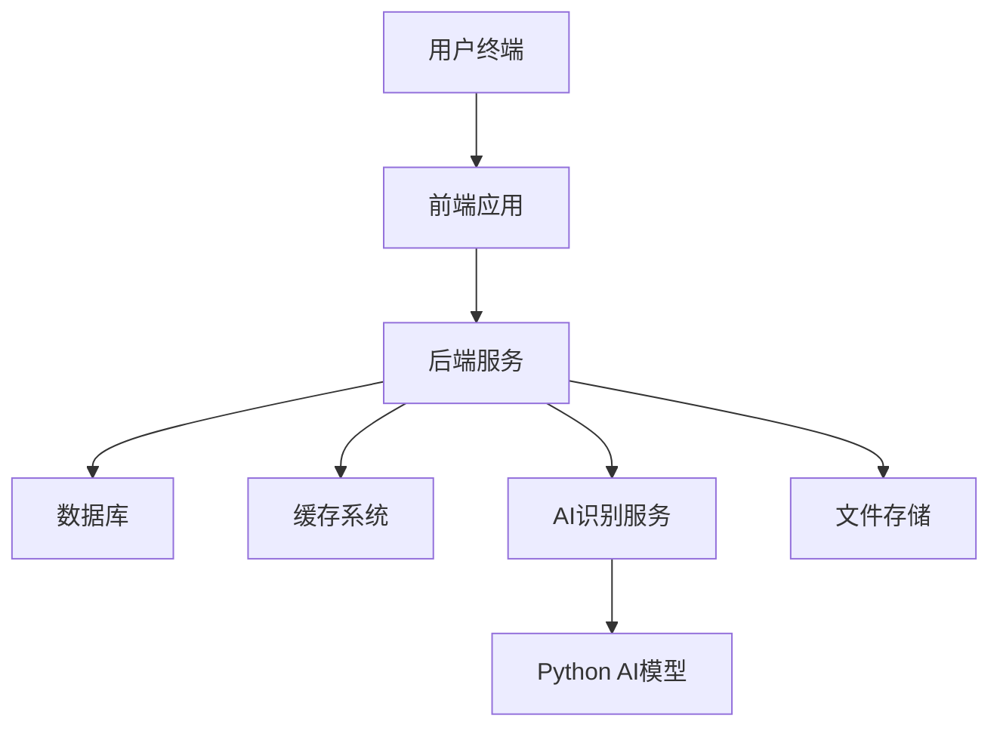
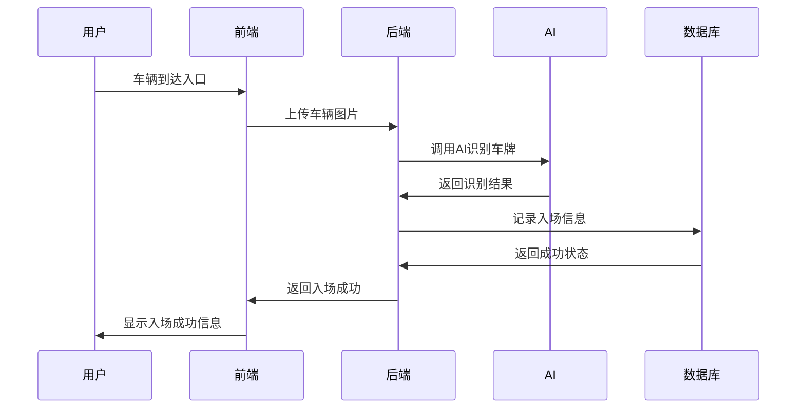
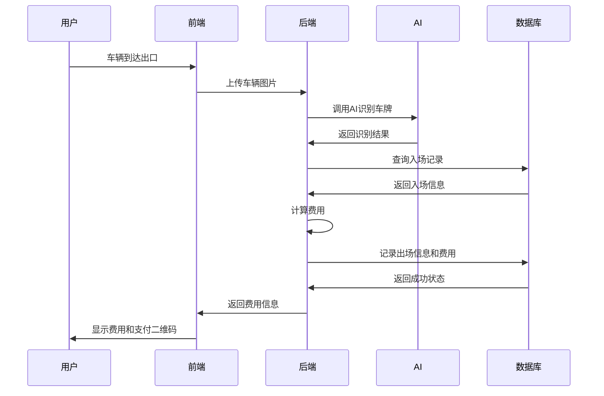

# 停车收费管理系统项目架构文档

## 1. 项目概述

停车收费管理系统是一个综合性的智能停车管理解决方案，整合了前端用户界面、后端业务逻辑处理和AI车牌识别技术，为停车场提供完整的车辆进出管理、计费和统计分析功能。

## 2. 技术架构

### 2.1 整体架构图



### 2.2 技术栈

#### 前端技术栈
- Vue 3.5.16
- Element Plus 2.11.2
- Vite 5.x
- Axios
- Vue Router 4.5.1
- Pinia状态管理

#### 后端技术栈
- Spring Boot 2.x
- MyBatis Plus
- Spring Security + OAuth2.0
- Redis缓存
- MySQL数据库

#### AI技术栈
- Python 3.x
- PyTorch
- OpenCV

## 3. 项目结构

### 3.1 前端项目 (TrafficManager)
```
TrafficManager/
├── src/
│   ├── api/               # API接口封装
│   ├── assets/            # 静态资源文件
│   ├── components/        # 公共UI组件
│   ├── layout/            # 页面整体布局
│   ├── router/            # 路由配置
│   ├── store/             # Pinia状态管理
│   ├── utils/             # 工具类函数
│   ├── views/             # 页面视图组件
│   └── App.vue            # 根组件
├── vite.config.js         # Vite构建配置
└── package.json           # 项目依赖与脚本
```

### 3.2 后端项目 (ParkingFeeServer)
```
ParkingFeeServer/
├── src/main/java/com/parking/manager/
│   ├── ParkingManagerApplication.java  # 启动类
│   ├── common/                        # 通用模块
│   │   ├── config/                    # 配置类
│   │   ├── constant/                  # 常量定义
│   │   ├── exception/                 # 全局异常处理
│   │   ├── result/                    # 统一返回结果
│   │   └── utils/                     # 工具类
│   ├── system/                        # 系统管理模块
│   │   ├── controller/
│   │   ├── service/
│   │   ├── mapper/
│   │   └── entity/
│   ├── parking/                       # 停车场管理模块
│   │   ├── controller/
│   │   ├── service/
│   │   ├── mapper/
│   │   └── entity/
│   ├── vehicle/                       # 车辆管理模块
│   │   ├── controller/
│   │   ├── service/
│   │   ├── mapper/
│   │   └── entity/
│   ├── charge/                        # 收费管理模块
│   │   ├── controller/
│   │   ├── service/
│   │   ├── mapper/
│   │   └── entity/
│   ├── inout/                         # 进出管理模块
│   │   ├── controller/
│   │   ├── service/
│   │   ├── mapper/
│   │   └── entity/
│   ├── statistics/                    # 统计报表模块
│   │   ├── controller/
│   │   ├── service/
│   │   ├── mapper/
│   │   └── entity/
│   └── monitor/                       # 系统监控模块
│       ├── controller/
│       ├── service/
│       ├── mapper/
│       └── entity/
├── src/main/resources/
│   ├── application.yml               # 主配置文件
│   └── mapper/                       # MyBatis XML映射文件
└── pom.xml                           # Maven配置文件
```

### 3.3 AI项目 (ai)
```
ai/
├── lpdemo.py              # 车牌识别主程序
├── lp.pt                  # 车牌识别模型
└── .venv/                 # Python虚拟环境
```

## 4. 核心功能模块

### 4.1 系统管理模块
- 用户管理：用户增删改查、权限分配
- 角色管理：角色定义、权限配置
- 菜单管理：系统菜单配置
- 部门管理：组织架构管理
- 字典管理：系统字典维护

### 4.2 停车场管理模块
- 车场信息：停车场基本信息维护
- 车位状态：实时车位状态监控
- 区域划分：停车场区域管理

### 4.3 车辆管理模块
- 车辆信息：车辆档案管理
- 车主信息：车主资料维护
- 黑名单管理：违规车辆管理

### 4.4 收费管理模块
- 收费标准：计费规则配置
- 优惠策略：优惠政策设置
- 费用计算：自动计费功能

### 4.5 进出管理模块
- 入场记录：车辆入场信息登记
- 出场记录：车辆出场信息处理
- 异常处理：特殊情况进行处理

### 4.6 AI集成模块
- 车牌识别：通过AI模型识别车牌号码
- 车位检测：检测车位占用状态
- 图像处理：车辆图像预处理和分析

### 4.7 统计报表模块
- 收入统计：停车收入数据分析
- 车流量分析：车辆进出流量统计
- 异常事件统计：异常情况汇总分析

### 4.8 系统监控模块
- 系统监控：应用性能监控
- 日志管理：操作日志记录
- 在线用户：在线用户统计

## 5. 数据库设计

### 5.1 核心数据表
- 用户表 (sys_user)
- 角色表 (sys_role)
- 菜单表 (sys_menu)
- 车场表 (parking_lot)
- 车位表 (parking_spot)
- 车辆表 (vehicle)
- 车主表 (owner)
- 收费记录表 (charge_record)
- 进出记录表 (inout_record)

## 6. 系统交互流程

### 6.1 车辆入场流程


### 6.2 车辆出场流程


## 7. 部署架构

### 7.1 开发环境
- 前端：Node.js + Vite
- 后端：Spring Boot内嵌Tomcat
- 数据库：MySQL本地实例
- 缓存：Redis本地实例
- AI：Python本地环境

### 7.2 生产环境
- 前端：Nginx部署静态文件
- 后端：Spring Boot应用集群部署
- 数据库：MySQL主从复制
- 缓存：Redis集群
- AI：独立Python服务或容器化部署

## 8. 安全设计

### 8.1 认证授权
- OAuth2.0认证机制
- JWT Token管理
- Spring Security权限控制
- Redis缓存Token

### 8.2 数据安全
- 敏感信息加密存储
- HTTPS通信加密
- SQL注入防护
- XSS攻击防护

## 9. 性能优化

### 9.1 前端优化
- 组件懒加载
- 图片压缩优化
- HTTP请求缓存
- 代码分割打包

### 9.2 后端优化
- 数据库连接池
- Redis缓存热点数据
- 接口限流控制
- 异步处理耗时任务

### 9.3 AI优化
- 模型轻量化
- GPU加速计算
- 批量处理图片
- 结果缓存机制

## 10. 监控与运维

### 10.1 系统监控
- 应用性能监控
- 数据库性能监控
- Redis缓存监控
- API调用统计

### 10.2 日志管理
- 操作日志记录
- 错误日志收集
- AI识别日志
- 系统运行日志